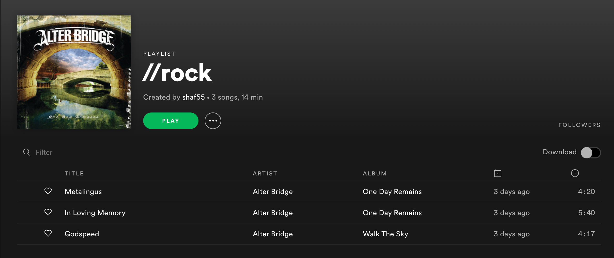
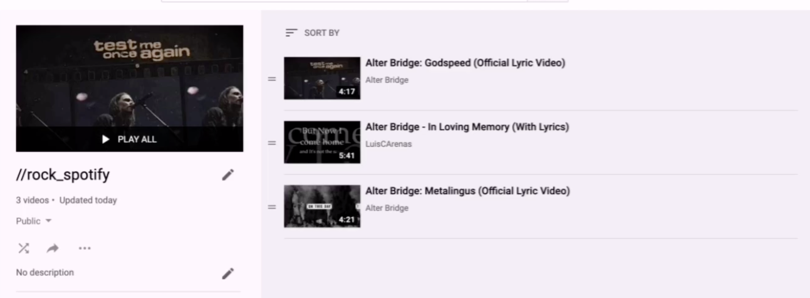

# SpotOnYou

### SpotOnYou use Spotify and Youtube Data API to generate your selected Spotify playlist into a Youtube Playlist.

#### What you need to run this project:

Spotify Related:

1. Spotify Client ID
2. Spotify Client Secret

[How to get Spotify Client ID and Client Secret](https://stackoverflow.com/questions/55927009/how-to-access-spotifys-web-api-with-client-id-and-secret)

Youtube Related:

1. Api key
2. OAuth 2.0 Client IDs

**You can generate them from google developer console**

#### What Does this program do:

So this python(jupyter notebook) takes your spotify playlist id according to which one you choose, then it connects to youtube and search those tracks and add them to your youtube playlist. Here's an image demonstration:

**This is my spotify playlist //rock (as you can see I have three songs here):**

**After running the script your youtube playlist which you chose to add all the tracks will look like:(Initially you have to have a blank playlist)**

**There are some Restrictions:**

Spotify and Youtube does not allow to request or add more than 50 times with API. So I guess we are stuck here for that limit. Other than that, It works totally fine.
